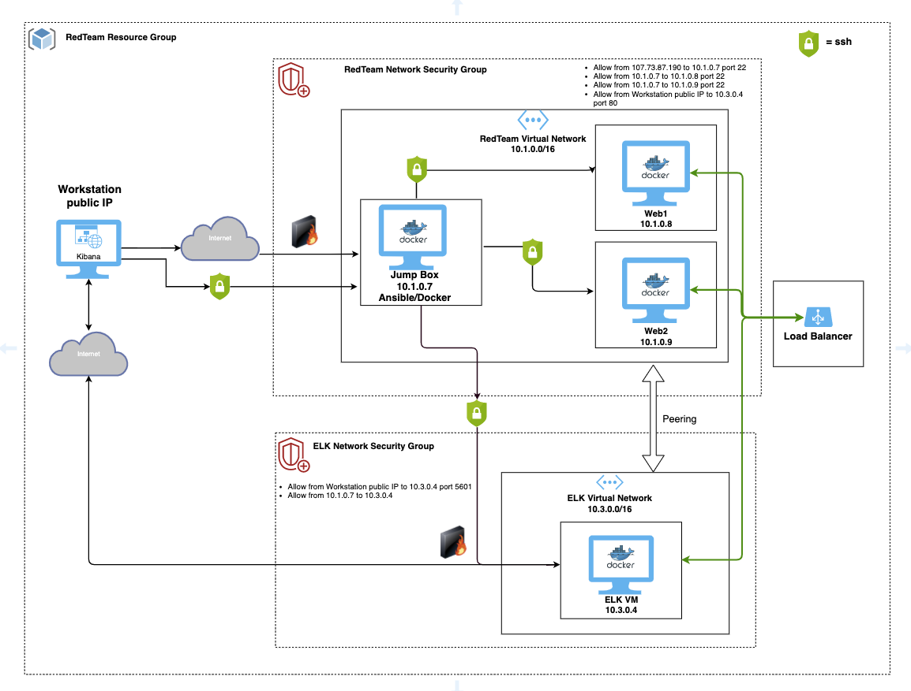
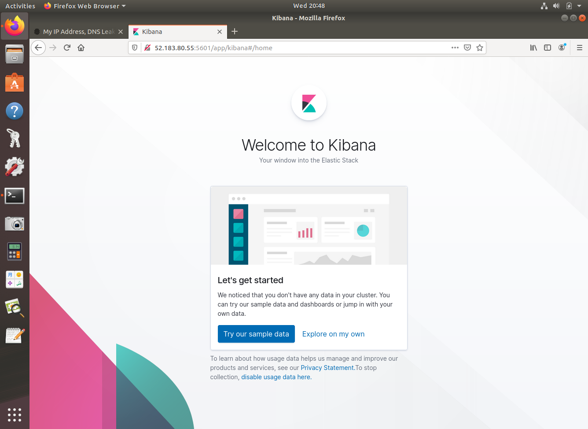
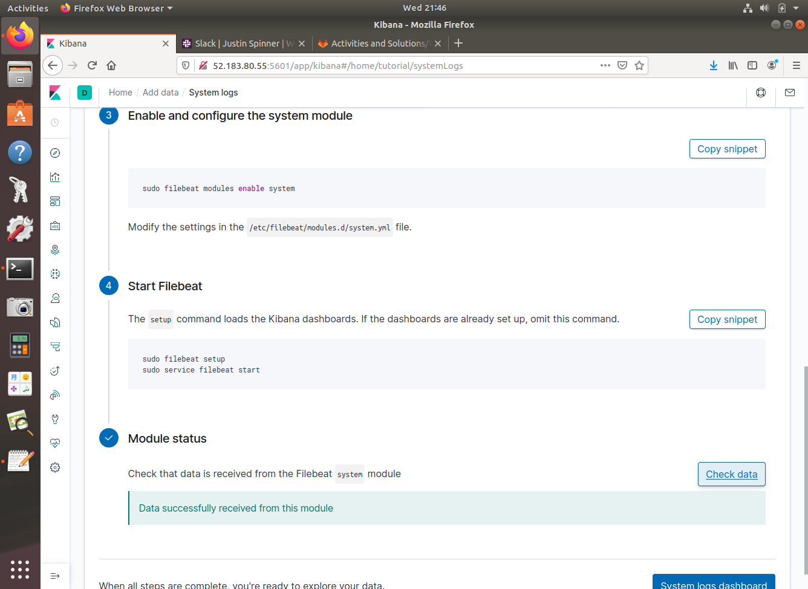
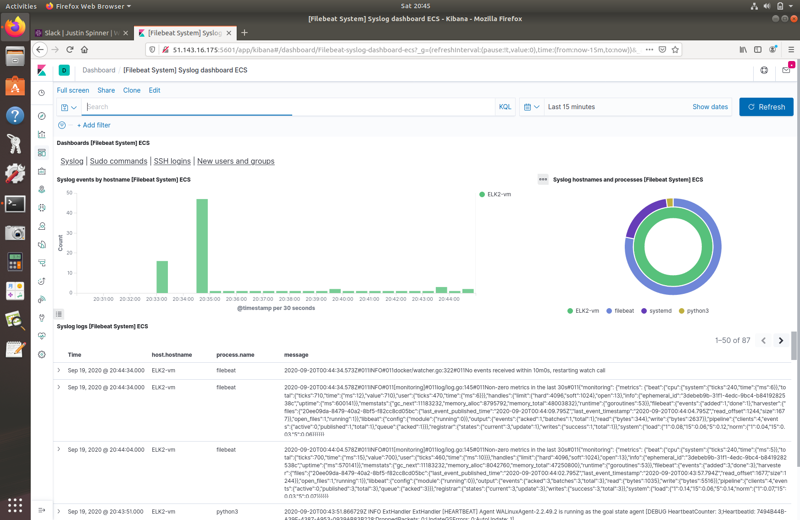
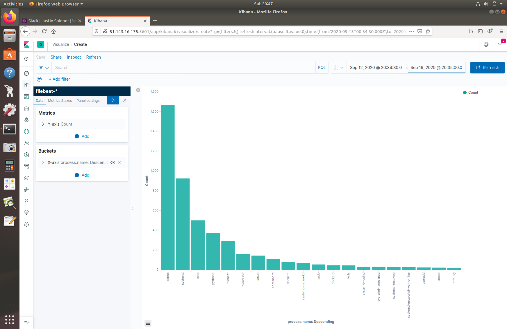
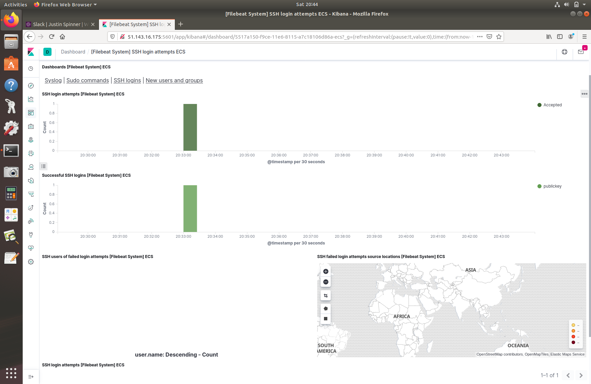

# Microsoft Azure ELK Stack

Setting up an ELK stack through Microsoft Azure to monitor 2 web virtual machines (DVWA) backed by a load balancer.

First, a "**Jump Box**" virtual machine is configured so that we can provision each VM instance and use Ansible/Docker for the Web and ELK VMs. The **Jump Box** acts as a secure gateway so that there is seperation between the main workstation and our deployed Web/ELK virtual machines we are provisioning.  Once the Web1, Web2, and ELK machines are up, we use Kibana to monitor our ELK instance from the workstation machine browser.  Refer to the detailed setup instructions under the Setup folder.

# Network Diagram



----
## Setup

**Virtual Machines**:
1. Workstation 
    - shh-keygen, copy public key to JumpBox VM instance.
2. JumpBox - login via ssh from Workstation.  
    - shh-keygen, copy public key to Web3, Web4, & ELK VM instance.
3. Web3 - DVWA (DAMM VULNERABLE WEB APP) machine.  Login via ssh from JumpBox
4. Web4 - DVWA machine.  Login via ssh from JumpBox
5. ELK - DVWA machine.  Login via ssh from JumpBox

----	
## Configuring Jump Box VM
* Linux, Ubuntu Server 18.04 LTS - Gen1
* Standard B1s, 1 GiB RAM, 1 vCPU
* Private IP: 10.1.0.7
* username: azadmin
* ssh-key: public key from Workstation VM

----
## Configuring Web1 VM
* Linux, Ubuntu Server 18.04 LTS - Gen1
* Standard B1s, 1 GiB RAM, 1 vCPU
* Private IP: 10.1.0.8
* username: azadmin
* ssh-key: public key from Jump Box/Ansible VM

----
## Configuring Web2 VM
* Linux, Ubuntu Server 18.04 LTS - Gen1
* Standard B1s, 1 GiB RAM, 1 vCPU
* Private IP: 10.1.0.9
* username: azadmin
* ssh-key: public key from Jump Box/Ansible VM

----
## Configuring ELK VM
* Linux, Ubuntu Server 18.04 LTS - Gen1
* Standard B2s, 4 GiB RAM, 2 vCPU's
* Private IP: 10.3.0.4
* username: azadmin
* ssh-key: public key from Jump Box/Ansible VM

----
## Ansible/Docker Setup
Ansible Files to use for setting up the DVWA and ELK web VM's:
- Ansible/pentest.yml
- Ansible/install-elk.yml
- Ansible/filebeat-playbook.yml
- Ansible/metricbeat-playbook.yml

Change: /etc/ansible/hosts
```
[webservers]
10.1.0.8 ansible_python_interpreter=/usr/bin/python3
10.1.0.9 ansible_python_interpreter=/usr/bin/python3

[elkservers]
10.3.0.4 ansible_python_interpreter=/usr/bin/python3
```

Change: /etc/ansible/ansible.cfg:
```
# default user to use for playbooks if user is not specified
# (/usr/bin/ansible will use current user as default)
remote_user = azadmin
```

----
# Kibana

## Kibana Welcome Screen


## Starting Filebeat

Navigate to the tutorial on Installing Filebeat and walkthrough the instructions from the ELK VM.
 ```
azadmin@ELK-vm: curl -L -O https://artifacts.elastic.co/downloads/beats/filebeat/filebeat-7.6.1-amd64.deb
azadmin@ELK-vm: sudo dpkg -i filebeat-7.6.1-amd64.deb
azadmin@ELK-vm: sudo filebeat modules enable system
azadmin@ELK-vm: sudo filebeat setup
azadmin@ELK-vm: sudo service filebeat start
```


----
# Filebeat Dashboard

### System Log and Processes


### Log of Processes by name


### Log of SSH Login attempts

